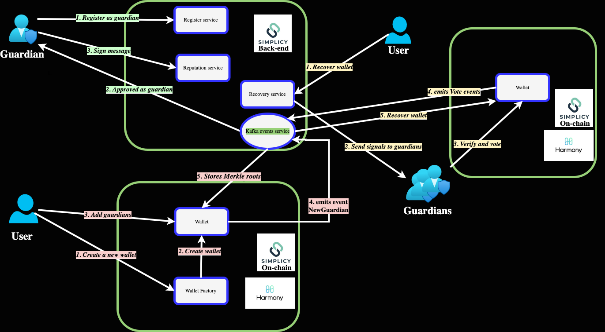
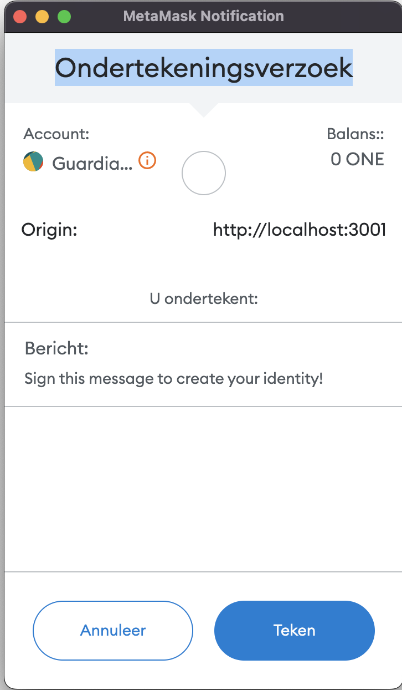
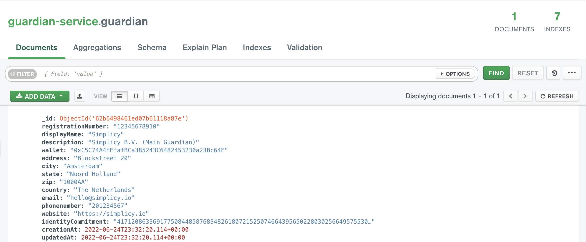

# zkWallet (Social Recovery) <!-- omit in toc -->


zkWallet is a smart contract wallet using zk-SNARKS to restore a user's access to their smart contract wallet, without revealing any information of the user's and guardians.

The project is currently on [Harmony Testnet](https://explorer.pops.one/) and the frontend is hosted on [Vercel](https://github.com/vercel/vercel).

zkWallet Link:

<https://zkwallet.simplicy.io/>

Guardian Registration Link:

<https://guardian.simplicy.io/>

Guardian Recovery Link:

<https://guardian.simplicy.io/recovery>

zkWallet Demo Video:
<https://youtu.be/dmwbmxZyMyY>

## Table of Contents <!-- omit in toc -->

- [Background](#background)
  - [What is social recovery](#social-recovery)
  - [Our approach](#our-approach)
    - [Overview](#flow-overview) 
    - [Guardian Registration flow](#guardian-registration)
    - [Regular flow for a Owner](#owner-flow)
    - [Recovery Flow for Guardians](#recovery-flow)
    - [Guardian Management Flow for an Owner](#guardian-management)
- [Project Structure](#project-structure)
  - [circuits](#circuits)
  - [contracts](#contracts)
  - [guardian-service](#guardian-service)
  - [guardian-ui](#guardian-ui)
  - [zkWallet-ui](#wallet-ui)
- [Zero Knowledge Structure](#zk-structure)
- [Run Locally](#run-locally)
  - [Clone the Repository](#clone-the-repository)
  - [Get the Submodules](#get-submodules)
  - [Run circuits](#run-circuits)
  - [Run contracts](#run-contracts)
  - [Run Guardian Service](#run-guardian-service)
  - [Run Guardian UI](#run-guardian-ui)
  - [Run Wallet UI](#run-wallet-ui)
- [Deployed contracts](#deployed-contracts)
  - [Polygon](#deployed-polygon)
  - [Polygon](#deployed-optimism)
  - [Devnet](#deployed-devnet)

## Background

### What is social recovery
Social recovery is a smart contract wallet technique whereby a user is able to grant trusted persons the ability to restore the user access to their account. This is useful in case the user accidentally gets locked out of their account - access can simply be restored and the user is able to again access their account. 

Vitalik released a [post](https://vitalik.ca/general/2021/01/11/recovery.html) about the need for wider adoption of social recovery wallets. Multi-sigs have thus far been the standard for more secure custody of funds, but require multiple parties to coordinate on transactions. Using just a single key paradigm (e.g. Metamask) can lead to loss of funds if the private key is lost, or theft if a hacker acquires the single private key. Thus, we have social recovery wallets. 

Social Recovery wallets are designed to mitigate against two scenarios: 
1. The user loses their private key 
2. A hacker obtains a user's private key

The image below describes the flow of a social recovery wallet. A single owner is able to sign off on transactions, but a set of guardians is able to change the owner (the signing key). 


<a name="our-approach"/>

### Our approach
The previous approach places the Ethereum address of the guardian in plain text on-chain. We seek to instead keep the guardian address private, whilst still allowing social recovery functionality.

To do this, when a user is adding a guardian, using zero knowledge addGuardians() with Semaphore. Semaphore allows Ethereum users to prove their membership of a group and send signals such as votes or endorsements without revealing their original identity. 

<a name="flow-overview"/>

#### Overview


<a name="guardian-registration"/>

#### Guardian Registration flow
- Guardian register to **register-service**
- Guardian sign with identitycommitment
- After approval, the identitycommitment of the guardian is saves in the **factory contract**

| Step 1                                                                     | Step 2                                                                        |
| :---                                                                       | :---                                                                          |
|     |                |                                                
| mongodb result:                                                            |  |

<a name="owner-flow"/>

#### Regular flow for a Owner
Social recovery wallets are meant to minimze the burden that an owner faces when making transactions. Thus, the flow consists of just a call `acceptOwnership()` with the new nominee wallet address

<a name="recovery-flow"/>

#### Recovery Flow for Guardians
In the event that an owner loses their private key, guardians can be notified and a recovery process can be kicked off. 
- Guardian calls `**recover**` with the address of the newOwner.
- `majority` number of guardians call `recover` with the newOwner.
- If majority agreed with the newOwner, the new owner address will become a nominee wallet address

<a name="guardian-management"/>

#### Guardian Management Flow for an Owner
Owners have the ability to swap out guardians in the case that a guardian's keys are compromised or a guardian becomes malicious. 
- Owner calls `removeGuardian` or ``removeGuardians` with hash of a guardian's. 
- Owner calls `addGuardian` or `addGuardians` with the hash of the guardian's. This queues the guardian for adding – the guardian can only be added after a time delay of 3 days. 

<a name="project-structure"/>

## Project Structure

The project has five main folders within packages directory:

- packages/zkWallet-contracts/circuits
- packages/zkWallet-contracts/contracts
- packages/guardian-service
- packages/guardian-ui
- packages/zkwallet-ui

<a name="circuits"/>

### circuits

The [circuits folder](/packages/zkWallet-contracts/circuits/) contains all the circuits used in zkWallet.
To learn more about the zkSocialRecoveryWallet circuits, read the [README file](/packages/zkWallet-contracts/circuits/README.md) inside the `circuits` folder.

<a name="contracts"/>

### contracts

The [contracts folder](/packages/zkWallet-contracts/contracts) contains all the smart contracts used in zkWallet.

To learn more about the zkSocialRecoveryWallet smart contracts, read the [README file](/packages/zkWallet-contracts/contracts/README.md) inside the `contracts` folder.


<a name="guardian-service"/>

### guardian-service
The [guardian-service folder](/packages/guardian-service/) contains guardian backend build with [Nestjs](https://nestjs.com/).

<a name="guardian-ui"/>

### guardian-ui
The [guardian-ui folder](/packages/guardian-ui/) contains frontend build with [Next.js](https://nextjs.org/).

### zkWallet-ui
The [zkwallet-ui folder](/packages/zkwallet-ui/) contains frontend for wallet management build with [Next.js](https://nextjs.org/).


<a name="zk-structure"/>

## Zero Knowledge Structure

The following graphic shows the structure of the most important zero knowledge elements of the zkSocialRecoveryWallet project.

```text
├── packages
│   ├── zkWallet-contracts
│   │   ├── build
│   │   │   ├── snark-artifacts
│   │   │   │   ├── semaphore.wasm
│   │   │   │   ├── semaphore.zkey
│   │   ├── circuits
│   │   │   ├── semaphore.circom
│   │   │   ├── ecdh.circom
│   │   │   ├── tree
│   │   │   │   ├── hasherPoseidon.circom
│   │   │   │   ├── poseidon
│   │   │   │   │   ├── poseidonHashT3.circom
│   │   │   │   │   ├── poseidonHashT4.circom
│   │   │   │   │   ├── poseidonHashT5.circom
│   │   │   │   │   ├── poseidonHashT6.circom
│   │   ├── contracts
│   │   │   ├── contracts
│   │   │   │   ├── facets
│   │   │   │   │   ├── GuardianFacet.sol
│   │   │   │   │   ├── RecoveryFacet.sol
│   │   │   │   │   ├── SemaphoreFacet.sol
│   │   │   │   │   ├── SemaphoreGroupsFacet.sol
│   │   │   │   ├── recovery
│   │   │   │   │   ├── IRecovery.sol
│   │   │   │   │   ├── IRecoveryInternal.sol
│   │   │   │   │   ├── Recovery.sol
│   │   │   │   │   ├── RecoveryInternal.sol
│   │   │   │   │   ├── RecoveryStorage.sol
│   │   │   │   ├── semaphore
│   │   │   │   │   ├── base
│   │   │   │   │   │   ├── SemaphoreCoreBase
│   │   │   │   │   │   │   ├── ISemaphoreCoreBase.sol
│   │   │   │   │   │   │   ├── ISemaphoreCoreBaseInternal.sol
│   │   │   │   │   │   │   ├── SemaphoreCoreBase.sol
│   │   │   │   │   │   │   ├── SemaphoreCoreBaseInternal.sol
│   │   │   │   │   │   │   ├── SemaphoreCoreBaseMock.sol
│   │   │   │   │   │   │   ├── SemaphoreCoreBaseStorage.sol
│   │   │   │   │   │   ├── SemaphoreGroupsBase
│   │   │   │   │   │   │   ├── ISemaphoreGroupsBase.sol
│   │   │   │   │   │   │   ├── ISemaphoreGroupsInternal.sol
│   │   │   │   │   │   │   ├── SemaphoreGroupsBase.sol
│   │   │   │   │   │   │   ├── SemaphoreGroupsBaseInternal.sol
│   │   │   │   │   │   │   ├── SemaphoreGroupsBaseMock.sol
│   │   │   │   │   │   │   ├── SemaphoreGroupsBaseStorage.sol
│   │   │   │   │   ├── extensions
│   │   │   │   │   │   ├── SemaphoreVoting
│   │   │   │   │   │   │   ├── ISemaphoreVoting.sol
│   │   │   │   │   │   │   ├── ISemaphoreVotingInternal.sol
│   │   │   │   │   │   │   ├── SemaphoreVoting.sol
│   │   │   │   │   │   │   ├── SemaphoreVotingInternal.sol
│   │   │   │   │   │   │   ├── SemaphoreVotingStorage.sol
│   │   │   │   │   ├── ISemaphore.sol
│   │   │   │   │   ├── ISemaphoreGroups.sol
│   │   │   │   │   ├── ISemaphoreInternal.sol
│   │   │   │   │   ├── Semaphore.sol
│   │   │   │   │   ├── SemaphoreInternal.sol
│   │   │   │   │   ├── SemaphoreStorage.sol
│   │   │   │   ├── utils
│   │   │   │   │   ├── cryptography
│   │   │   │   │   │   ├── IncrementalBinaryTree
│   │   │   │   │   │   │   ├── IIncrementalBinaryTree.sol
│   │   │   │   │   │   │   ├── IIncrementalBinaryTreeInternal.sol
│   │   │   │   │   │   │   ├── IncrementalBinaryTreeInternal.sol
│   │   │   │   │   │   │   ├── IncrementalBinaryTreeStorage.sol
│   │   │   │   │   │   ├── Hashes.sol
│   │   │   │   │   ├── Constant.sol
│   │   │   │   ├── verifier
│   │   │   │   │   ├── Verifier20.sol
├── packages
│   ├── guardian-ui
│   │   ├── public
│   │   │   ├── semaphore.wasm
│   │   │   ├── semaphore_final.zkey
```

To see the full directory structure of the smart contracts, see [README file](/packages/zkWallet-contracts/contracts/README.md) inside the `contracts` folder.

<a name="run-locally"/>

## Run Locally

<a name="clone-the-repository"/>

### Clone the epository

```bash
git clone https://github.com/zkWallet/zkWallet-docs.git
```
<a name="get-submodules"/>

### Get the Submodules

```bash
git submodule update --init --recursive
```

<a name="run-circuits"/>

### Run circuits

To run cicuits, go inside the `contract` folder:

```bash
cd packages/zkWallet-contracts/
```

Run:

```bash
yarn compile:circuits
```

See also the follow the intructions in the [README file](/packages/zkWallet-contracts/contracts/circuits/README.md) in the  **`circuits`** folder.

<a name="run-contracts"/>

### Run contracts

To run contracts, go inside the **`contracts`** folder:

```bash
cd packages/zkWallet-contracts/
```

Then, follow the intructions in the [README file](/packages/zkWallet-contracts/README.md) in the `contracts` folder.

<a name="run-guardian-service"/>

### Run Guardian service

To run the Guardian Service, go inside the **`guardian-service`** folder:

```bash
cd packages/guardian-service
```

Then, follow the intructions in the [README file](/packages/guardian-service/contracts/README.md) in the `guardian-service` folder.

<a name="run-guardian-ui"/>

### Run Guardian ui

To run the Guardian Ui, go inside the **`guardian-ui`** folder:

```bash
cd packages/guardian-ui
```

Then, follow the intructions in the [README file](/packages/guardian-ui/README.md) in the `guardian-ui` folder.

<a name="deployed-contracts"/>

## Deployed contracts

<a name="deployed-polygon"/>

### Polygon Mainnet

 Name                     | Harmony One Devnet                              | Version       | Status   |
| :---                    | :---                                            |  :---         | :---     |
| Verifier20              | 0x8D4d6E93a68a47ED4aD2C81635C3A7D21fb9077B      | 1.0.0         | verified |
| PoseidonT3              | 0xa78bc68617ab5556b6A3DEf92f515B559E410Ac8      | 1.0.0         |          |
| ERC20ServiceFacet       | 0xbC8FA821717f7e200b89305c1299534968A97460      | 0.1.0.alpha   | verified |
| ERC721ServiceFacet      | 0xFf0fc78e425c966E93b1B01361508B895431F37C      | 0.1.0.alpha   | verified |
| GuardianFacet           | 0x5182a1ae86a294e4DafE1f3B74BE577399a0a958      | 0.1.0.alpha   | verified |
| RecoveryFacet           | 0x5448Fe62Eb288C1f7e99172E3576b9767749b91F      | 0.1.0.alpha   | verified |
| EtherServiceFacet       | 0x595dF113b9fA0491E41e3fb4c7872bD607f8796a      | 0.1.0.alpha   | verified |
| SemaphoreFacet          | 0x8574ebd614dc65F5d1D5A3b26565B67943756194      | 0.1.0.alpha   | verified |
| SemaphoreGroupsFacet    | 0xc6b07957868bf4b8d4dAeC437e774D90699697C0      | 0.1.0.alpha   | verified |
| ZkWalletFactoryDiamond  | 0x7Cbe3DB16C1e29e2394B3D8EB190bB72Da9A098C      | 0.1.0.alpha   | verified |
| WalletFactoryFacet      | 0x23C6B32032b697903c2cF29F3513Fa6c6b44E69D      | 0.1.0.alpha   | verified |

<a name="deployed-optimism"/>

### Optimism Mainnet

 Name                     | Harmony One Devnet                              | Version       | Status   |
| :---                    | :---                                            |  :---         | :---     |
| Verifier20              | 0x8D4d6E93a68a47ED4aD2C81635C3A7D21fb9077B      | 1.0.0         | verified |
| PoseidonT3              | 0xa78bc68617ab5556b6A3DEf92f515B559E410Ac8      | 1.0.0         |          |
| ERC20ServiceFacet       | 0xbC8FA821717f7e200b89305c1299534968A97460      | 0.1.0.alpha   | verified |
| ERC721ServiceFacet      | 0xFf0fc78e425c966E93b1B01361508B895431F37C      | 0.1.0.alpha   | verified |
| GuardianFacet           | 0x5182a1ae86a294e4DafE1f3B74BE577399a0a958      | 0.1.0.alpha   | verified |
| RecoveryFacet           | 0x5448Fe62Eb288C1f7e99172E3576b9767749b91F      | 0.1.0.alpha   | verified |
| EtherServiceFacet       | 0x595dF113b9fA0491E41e3fb4c7872bD607f8796a      | 0.1.0.alpha   | verified |
| SemaphoreFacet          | 0x8574ebd614dc65F5d1D5A3b26565B67943756194      | 0.1.0.alpha   | verified |
| SemaphoreGroupsFacet    | 0xc6b07957868bf4b8d4dAeC437e774D90699697C0      | 0.1.0.alpha   | verified |
| ZkWalletFactoryDiamond  | 0x7Cbe3DB16C1e29e2394B3D8EB190bB72Da9A098C      | 0.1.0.alpha   | verified |
| WalletFactoryFacet      | 0x23C6B32032b697903c2cF29F3513Fa6c6b44E69D      | 0.1.0.alpha   | verified |

<a name="deployed-devnet"/>

### Devnet

 Name                     | Harmony One Devnet                              | Version       | Status   |
| :---                    | :---                                            |  :---         | :---     |
| Alice Wallet            | 0x2FBf87AFCD35c291441Bc1dA23dabdbDB77b2100      | 0.1.0.alpha   |          |
| Verifier16              | 0xDF84B7D104276bE843a81FA0e7Ce4e7e1F73CA7E      | 1.0.0         | verified |
| Verifier17              | 0x79c905Ce62b38100C2eA7C5A40836960d56f7420      | 1.0.0         | verified |
| Verifier18              | 0x298DeD46C68639Bbe9b9CbDFEb63Aa82EcDE75Aa      | 1.0.0         | verified |
| Verifier19              | 0x27C673cdcD056FBb93F701438aab771d3C00634e      | 1.0.0         | verified |
| Verifier20              | 0x4c469d74a65BCfBA0D9500457Cc76Daff220098a      | 1.0.0         | verified |
| Verifier21              | 0xbFeB824187A9E046cA37264e234E987f5CFE10F8      | 1.0.0         | verified |
| Verifier22              | 0x08cbB7504E4227D4BfaE9B50f765dFe5404CDE8a      | 1.0.0         | verified |
| Verifier23              | 0xdCa536459b8eFc88cDD8e6d84a080694a687E3C2      | 1.0.0         | verified |
| Verifier24              | 0xA8C8255D0565eD61bf9ED024fA6Ec796764B9D26      | 1.0.0         | verified |
| Verifier25              | 0xAfacB48B9cdB93BadFe8Baae0543F4BD95460739      | 1.0.0         | verified |
| Verifier26              | 0xf6Df4abe7e909789326E4c023Ecf33D1108FF601      | 1.0.0         | verified |
| Verifier27              | 0xe5d7529917041ab3Bd2e67EAD06B54CD04b13aD3      | 1.0.0         | verified |
| Verifier28              | 0x2E4ea96cbF43BF4BBb699214eA988f28F17F3fF3      | 1.0.0         | verified |
| Verifier29              | 0x7445b0B183b5a74104fcF1A8fE70F9518c0D4605      | 1.0.0         | verified |
| Verifier30              | 0xD37b6C9Bd8dC97F7021856154D9773e3Df43995C      | 1.0.0         | verified |
| Verifier31              | 0x541252940a7F2e0b4E0Ab38737c9376c931a66C6      | 1.0.0         | verified |
| Verifier32              | 0xe0925FEf5F260b40bb64aDd86DFBFE7Da76B007F      | 1.0.0         | verified |
| PoseidonT3              | 0x56924BaA61e1F121218282336156Cc170c41B051      | 1.0.0         | verified |
| ERC20ServiceFacet       | 0x18b61b36FC991c095765Ed2c1D04E0875cDc21ac      | 0.1.0.alpha   |          |
| ERC721ServiceFacet      | 0x5A8215DDfcC356c9526499818eAd868ba4B9422C      | 0.1.0.alpha   |          |
| GuardianFacet           | 0x13522F1f4968BD85cDE1294536774430551518dB      | 0.1.0.alpha   |          |
| RecoveryFacet           | 0x8d9CB131635555E812418354648c1B645796031a      | 0.1.0.alpha   |          |
| EtherServiceFacet       | 0x40A94B5B3C1A3fb8D1F0FEA8F38FC6d69AE1161e      | 0.1.0.alpha   |          |
| SemaphoreFacet          | 0xe198d7010AfF9ADA90E349F69481Ad96856ee05b      | 0.1.0.alpha   |          |
| SemaphoreGroupsFacet    | 0x20Aea34C2441539D5A2497f2DF98bB93575c18ac      | 0.1.0.alpha   |          |
| ZkWalletFactoryDiamond  | 0xF64a874474EFAe562B3Ccec0d081C64b862696ed      | 0.1.0.alpha   |          |
| WalletFactoryFacet      | 0x878821Ef4f0F3Ab6e39bb342218C7497d9523cd1      | 0.1.0.alpha   |          |

